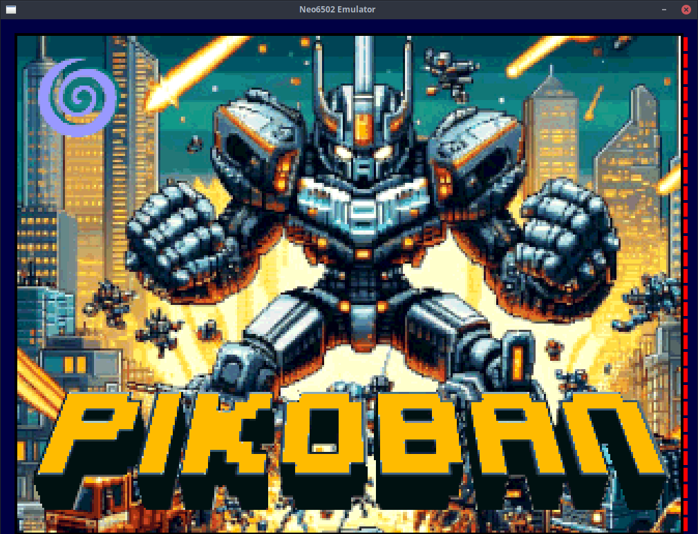
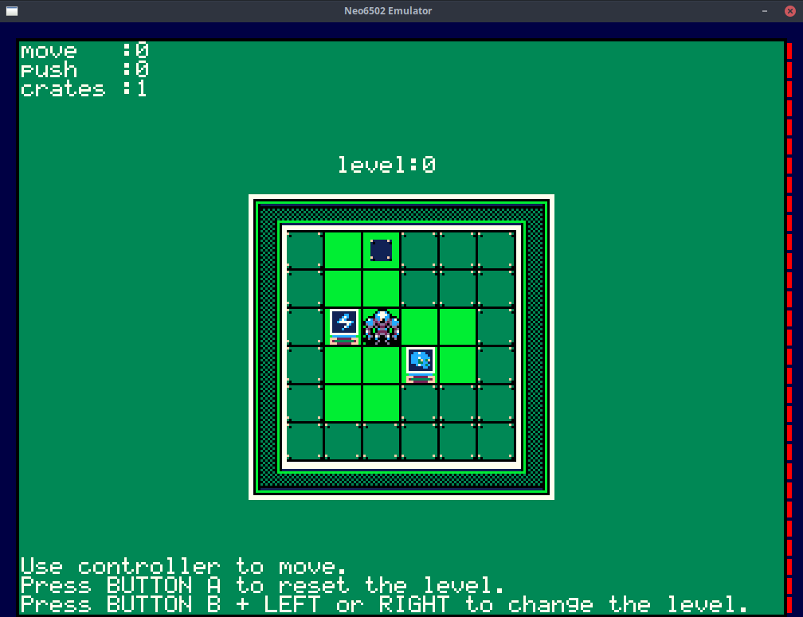

# µSoukoban
[µSoukoban](https://www.onlinespiele-sammlung.de/sokoban/sokobangames/robsy/) for [Neo6502](https://www.neo6502.com/) retrocomputer




__run__
```
emulator: neo pikoban_0x9000.bin@9000 run@9000
basic: load "pikoban.neo"
```
__controller mapping__
```
Firmware v0.14.1

JOY DIR  : z, x, m, k
BUTTON A : l
BUTTON B : ;
```
